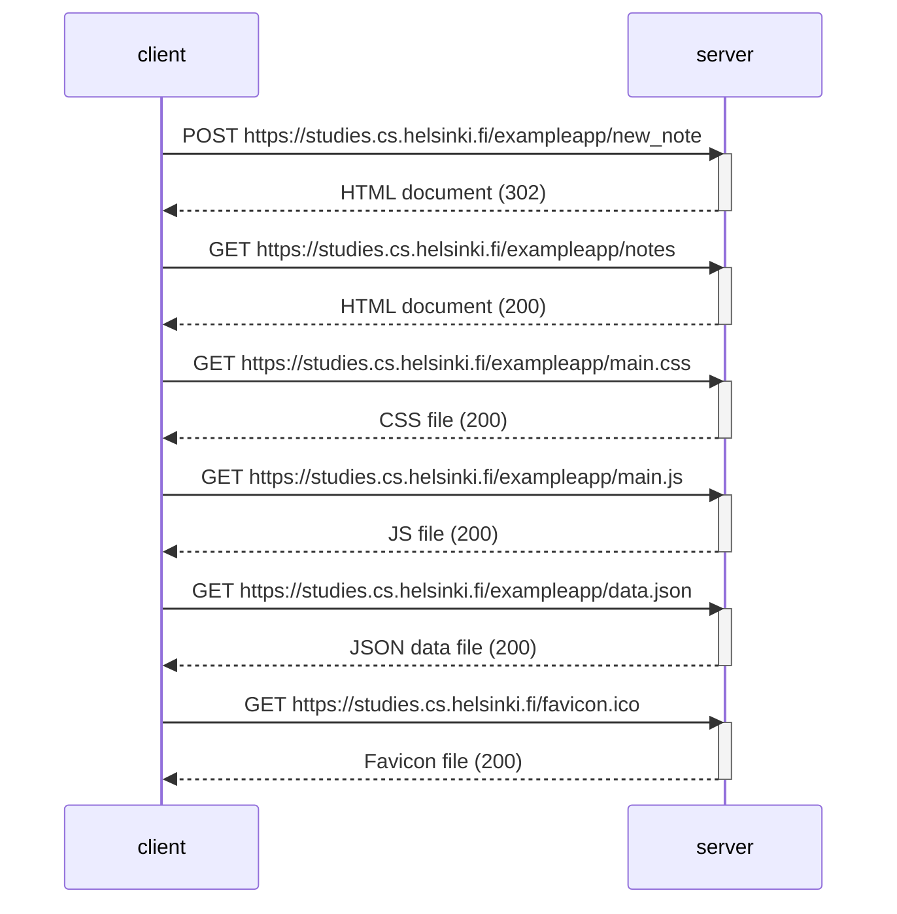

```mermaid
sequenceDiagram
  participant client
  participant server

  client->>server: POST https://studies.cs.helsinki.fi/exampleapp/new_note
  activate server
  server-->>client: HTML document (302)
  deactivate server

  client->>server: GET https://studies.cs.helsinki.fi/exampleapp/notes
  activate server
  server-->>client: HTML document (200)
  deactivate server

  client->>server: GET https://studies.cs.helsinki.fi/exampleapp/main.css
  activate server
  server-->>client: CSS file (200)
  deactivate server

  client->>server: GET https://studies.cs.helsinki.fi/exampleapp/main.js
  activate server
  server-->>client: JS file (200)
  deactivate server

  client->>server: GET https://studies.cs.helsinki.fi/exampleapp/data.json
  activate server
  server-->>client: JSON data file (200)
  deactivate server

  client->>server: GET https://studies.cs.helsinki.fi/favicon.ico
  activate server
  server-->>client: Favicon file (200)
  deactivate server
```
